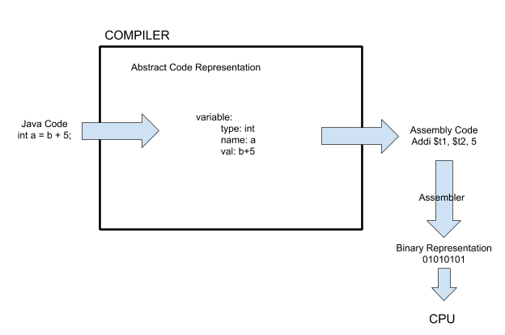
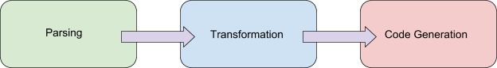
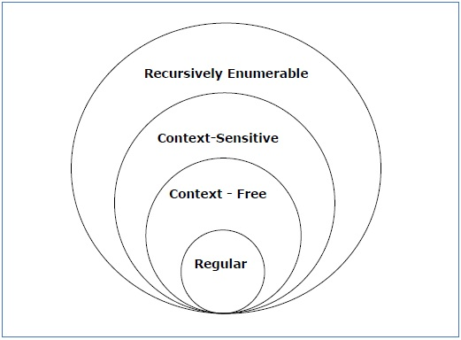
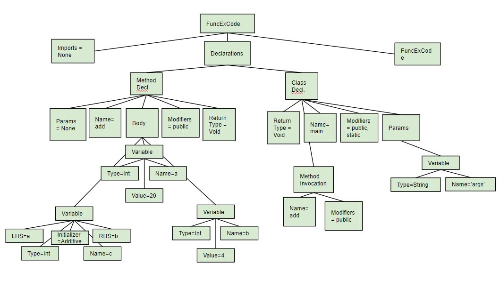

# Compiler Optimization: A Study of the Pipeline from Programming Languages to Assembly

With a interest in the processes surrounding executions of CPU instructions, we chose to investigate the transformation of programming languages to the basic instructions for CPU control. Via our learning in this course, we have a particular interest in optimizing to MIPS assembly language. In previous labs for this course, we brought a single cycle CPU design to an FPGA board. For that project, we concentrated on basic functionality: add, jump, branch, store etc. Now with this final project, we are able to connect the software down to FPGA implementation of basic functions. With research, we found ways to optimize code while compiling. Following this, we were able to investigate implementation of several optimization strategies. Via a combination of research and implementation, we have developed a deep understanding of the pipeline from high level programming languages to the binary commands that run a computer.

## Overview

First, we learned about the stages of compilation. We learned that a compiler is a tool that transforms source code from a higher level language to a generally lower level target language. Because we had 4 team members, we decided we would split the compilation process into a 2 step pipeline. The first compiler would transform code from Java to C and the second compiler would transform code from C to assembly. We also wanted to focus on the optimization step of compilation so we could see how the compiler works to make our code more efficient for our specific CPU architecture. We decided we would focus on the optimization step for our Java to C compiler because this compiler is higher level and thinking about the optimization at this level allows us to tie the work we are doing with this compiler into some of the things we learned about in computer architecture this semester.

<div style="text-align:center"></div>

## Compilation

As we learned this semester, assembly code serves as a mapping of binary CPU operations that is more easily human readable. Assembly is a super low level programming language and is translated into binary by the assembler that is then fed to the CPU. C code is a level up from assembly and is generally much easier for programmers to read and write than assembly. Java is yet another level up from C as more is handled by the language behind the scenes making it even easier for programmers to read and write.

The three stages of compilation are parsing, transformation, and code generation. Parsing is taking code and translating it into a more abstract representation of that same code. Transformation involves using the abstract representation of code from one language and making the necessary transformations and optimizations to move it into a lower level programming language. Finally, code generation takes the transformed representation of the code and translates it into a new string of code in the target programming language.

<div style="text-align:center"></div>

### Parsing

Parsing is the process of converting files of a certain type to a tokenized Abstract Syntax Tree. An Abstract Syntax Tree is simply a tree data structure that nests elements of the code using keyword tokens as branches. The important part here is that the essence and meaning of the code must be reflected in the syntax tree. No information can be lost when parsing. This is where Lexical Analysis comes in. Lexical Analysis converts the important information to a series of tokens. Tokens can be keywords taken from the code, operation signs, numerical constants, or even variable names. Tokens vary from parser to parser and often are written with the overall compiler design in mind. An example tokenization is given below:

```
// Java Code
while(x > i){
    p = p +1;
}
```
```
// Tokenization
WHILE, <ID,1>, GREATERTHAN, <ID,2>
<ID, 3>, EQUAL, <ID, 3>, (CONST,1)
```

In the above tokenization example the ID sections represent variables in the original code that are referred to and explained elsewhere in the abstract syntax tree. For example, `<ID,1>` refers to the first variable in the code, x.

This process can be broken down into two parts: scanning the code and grouping the token based on the code content. Scanning largely consists of ignoring comments and removing white space, essentially stripping the code down to the key information. Next the analyzer finds groups of tokens and their children values.

One approach is making a scanner and analyzer is to have a series of states that identify the meaning of a piece of code similar to the finite state machines we learned about this semester. For example, when scanning, you might be in a *commentIgnore* state or a *WhileStatement* state. These may be tokens themselves or simple states of the code to be used for organization of the AST. These states can be as high level as *MainFunc* state or as low level as *minusSign* state. The states are often organized in a table where columns represent the different states and rows represent characters in the code. A cell in the table is marked as true if the corresponding character represents the corresponding state. For example, in Java, if the character was "//" and the state was *commentIgnore* state, then that entry in the table would be true.

Once lexical analysis has been able to identify and group code pieces, the second phase of parsing begins where we are making the AST. Likewise with lexical analysis, there are several potential strategies. Some like *Recursive Descent Parsing* are simple yet require backtracking. Others are more complicated but are able to generate a tree with a single pass through.

Programming languages, like natural languages, have grammar. Even through programming languages are significantly more systematic they still require careful parsing of syntax rules that interpret meaning. For example, in the case of Java, a simple for each loop versus a regular for loop:

```
// Java for each loop
for(obj: setOfObjects){
    System.out.println(obj.name);
}
```
```
//Java for loop
for(int i = 0; i<N;i++){
    System.out.println(setOfObjects[i].name);
}
```


Here you have the same for loop key word, but the rest of the syntax is different and produces very different objects for the same end desired result. In an attempt to organize grammar, a hierarchical structure was made called *Chomsky Hierarchies of Grammars*. It consists of 4-5 levels that break down grammar rules into trees. Each level represent different rules for how grammar rules can be made.

<div style="text-align:center"></div>

The content of rules and particulars of each of these grammar types in the hierarchy is extensive but, even though they are extremely interesting, they are beyond the scope of this paper.

Parsing techniques like \textit{Recursive Descent Parsing} use grammar rules to trigger certain recursive paths.

In terms of language, you can say that tokens are like the alphabet of programming, the grammar is the syntax, and code can be formed by joining the alphabet according to the grammar rules. For example, in English the sentence "I have a dog named Roger." Makes sense because it has the proper word types in the proper order. Similarly,
`for(int i = 0; i< 10;i++){
}`
makes sense because the proper data types are in the correct order. Neither "Dog named Roger I have" nor
`// Original Code
int i; ++; for = 0{}`
make any sense. The point of the parser is to convert the "sense making" to another language.(If you know a different language you are just a human compiler)

Overall, there is plenty of room for efficiency optimization in parsing. Since the tokenizing process must touch every character of the code, the programmer must be careful to not let this piece of code's runtime get out of hand. In addition, there are many structures and techniques that have been tried and tested to work to varying levels of efficiency. In terms of optimization for compiling to machine code, there is not much to say for parsing. No matter the target language, the parsing of the source code is largely the same.

### Transformation

Transformation is the adapting or creation of a new AST tree to suit the target language code generation. Here much of the code optimization and compiler optimization opportunities arise. We can make any changes desired during the transformation as long as the original intention of the source code is met. Here many of the rules of traditional computer science fall apart as you tear down the code in the source language. For example, as a coder you know that you should use variables for readability. Since this makes the code considerably longer, the transformer might cut all the variables and use their values instead in one glob of code:

```
// Original Code
int a = 100;
int b = 0.5;
int c = 23;
int output = (a*b)+c*(a/b);
// Transformed Code
int output = (100*0.5)+23*(100/0.5)
```

Many of transformation optimization techniques are looking for ways to make code run more efficiently. The optimization section of this report dives into the many ways to optimize code during transformation.

Mechanically, transformation works by parsing the source code's AST and simultaneously writing a new optimized tree formatted for the target language. For example, if your target language was MIPS machine language, a simplistic change might be to group sections of the code that run together and their jump conditionals under a certain token.

### Code Generation

In large part, code generation is follows the same rules and processes of parsing but inverted. Additional rules must be used to allow for optimized use of the target language. For example, with machine language, you have to decide which registers to use and when. For every leaf of the AST, we need to decide what is corresponds to in the target language, what register/memory allocation is needed, and where to put it in the final code.

During code generation, the compiler iterates over every element in the transformed abstract syntax tree and converts it into code in the target programming language. The output at the end of code generation is a string of (ideally optimized) code written in the target programming language.

## Optimization

There are many different optimizations that can be included in the compilation process. The best compilers take advantage of both CPU specific and application specific optimizations when the compilation is done. In some cases, code that would not be as advisable to write from a proper programming standpoint would actually run more efficiently on a CPU. It is the compiler's job to find these types of cases and transform the code appropriately. In fact, compiler performance is the single most important variable affecting program performance.

One optimization that we chose to implement in our compiler was function inlining. Function inlining is the process of eliminating overhead from jumping to and returning from a function simply by inlining the function code wherever the function is called. This is a classic example of the space versus time tradeoff we spoke about in class this semester. The code can run more efficiently if it does not have to jump around to get to a function definition, but if the function is called many times, inlining it wherever it is called can significantly increase the amount of code and therefore, the space that code takes up in memory. Some compilers check function size when performing this optimization to see if a function can be inlined without increasing the overall program size.

Another optimization that some compilers might implement is profile driven optimization. In profile driven optimizations, a profile of the program is created by sending information on program behavior back to the compiler for future compilations. The compiler is then able to do things like swap an if else clause if the first part is executed more often and allocate registers based on the number of times a variable is used when the program is executed. It can also do something called "loop unrolling" which effectively "unrolls" a loop by copying it out for each iteration in cases of loops which are executed most frequently. It can even set the default branch for branch operations that the CPU performs with guess and check to be the branch most often taken.

Another possible optimization involves making all recursive functions tail recursive. In this optimization, the code is modified so that variables and values do not need to be stored between recursive calls. We can do this by storing all variables that we need between runs within the parameters for the function.

An example original recursive function:
```
def sumn(n):

    if (n == 0):
        return 1

    return n + sumn(n-1)
```
The same function after optimized with tail recursion:
```
def sumnTR(n, a):

    if (n == 0):
        return a

    return sumnTR(n - 1, n + a)
```
Another one of the more basic techniques for optimization during compilation is interprocedural analysis. The goal of this process is to minimize load and store operations by keeping as many variables as possible in registers. One way to do this is to examine the code when a function is called and move subexpressions that are calculated inside a loop (and that do not change each time through) out of the loop so that they are only calculated and stored once. Another thing that can be done is to be sure to only save registers that are actually used by the function in question.

One other optimization that compilers can perform that was particularly relevant to us in our understanding of computer architecture was instruction scheduling. This optimization happens after all other optimizations. It depends on both the instruction pipeline and how many instructions per cycle can be issued by the specific architecture. The main goal of an instruction scheduling optimization is to move things around such that we minimize the number of times an instruction is using an operand calculated by a load instruction immediately before it. This explains how the compiler is actually able to help our CPU avoid data hazards and minimize the need for forwarding.

In theory, with all optimization techniques implemented, we could make the computer work in parallel manner with hardware designed for serial computation. However, there are significant limitations. For loop unrolling, the number of iterations must be known before the loop is entered and this is not possible in all cases. Also, if there is any abnormal exit such as jump from inside of the loop to outside or return statement, such loop cannot be candidated for parallelism.

Although we were not able to actually implement all or even most of these optimizations in our compiler, we were able to learn a lot about how compilers interact with the CPU and can make the code we write in higher level programming languages as efficient as possible.


## Implementation

Coming into this project, we recognized that building 2 full scale compilers was not going to be possible within the small amount of time we had. Each step of the implementation had the opportunity to be a full scale 2-week project by itself. For the Java to C and the C to Assembly compiler, we were able to mock up our own compilers with some basic optimizations while making heavy use of the PLY python library to help us with the parsing and code generation steps.

### Java to C Compiler

For our Java to C compiler, we decided we wanted to focus mostly on the transformation stage of compilation. We did not want to spend much time on parsing and code generation for two languages that are both higher level than we really learned about in computer architecture this semester. For this reason, we found Python libraries that were able to do these steps for us. One Python library performed parsing for us by taking the Java code and translating it into an abstract syntax tree. Another library was able to do code generation by taking a C abstract syntax tree and translating it into C code. We focused on the implementation for the transformation step. During this step, we took the Java abstract syntax tree and transformed it into a C abstract syntax tree. We also wanted to focus on adding some optimizations during this step so that our code would perform better when loaded onto a CPU. The main optimization that we implemented was function inlining. We did this by taking any functions in our Java code and inlining them into our main function in our new abstract syntax tree. Our compiler does not have any checks to ensure that doing this will not significantly increase the length of our code. In this way, we have made a tradeoff aiming for a faster runtime and giving up any space in memory we may have saved by not copying over the function every time it is called.

We heavily used plyj to convert Java code into an AST. Plyj is a version of Ply that parses java code. Ply is a lexical/parsing (Lex/Yacc) tool written in Pyton.  Some of the features in ply include standard lexical analysis and parsing features: error checking, AST tree generation, language-specific capability.

Given the following java code the output of using plyj is the following tree:

```
public class ExampleMinNumber {

  public void add(){
    int a = 20;
    int b = 4;
    int c = a+b;
  }

   public static void main(String[] args) {
      add();

   }

}
```
<div style="text-align:center"></div>

As previously mentioned, we focused on the basic functionality in MIPS assembly. Our target was to be able to compile a java function that requires jumps, stores, and basic operations. Therefore, our code translator a highly simplified version of a normal translator that would be able to handle the full grammar of java.

Our translator implemented inline optimization. As a side effect, this design made the translator simpler since we only had to create and store the main function. This meant we did not have to organize multiple function assignment, definitions, parameters etc. we could replace parameters with variable values and combine all variables and methods. After scanning the tree for the variables and operations, we build up new C based tree with the pyparser module. This program was made to complete the code generation step for us. This created are target C code. How the ply parser and the pyparser code generator works are more explained in the beginning section of this report.

### C to Assembly Compiler

Once we have made the transition from a high level language (Java) to a lower level language (C), we can again transition to the basic assembly code that will instruct our CPU. Using ply library once again, we attempted to implement the C to Assembly compiler. The compiling process is similar to high level language (Java) to a lower level language (C), except the variable assignment. The machine has limited number of registers therefore we cannot simply load a value to register. For our implementation, we hardcoded which variables go to which register since we have known source code of C. However, compiler developers do not know what users will input except input language, so they have to develop some way of dealing with memories.

For a global variable, it exists only once in the program and compiler reserves one memory area of 4 bytes in a data array with a fixed address. Then, in order to execute a compiled program, variable's address is needed as static data memory. Then, the compiler remembers the address and operate load word or write instruction for saved address in static data memory. When the number of variables of given program exceeds the number of available registers, "Spilling" occurs. Then, spilled variable's addresses are replaced with "store" to a static data memory and called by loads, which reduces the memory traffic. Some compilers such as x86 compiler offers register-to-register spilling. In other words, they can store and load the general-purpose register's instruction to SIMD, registers from differernt class.

If we only focuses on optimization process, it will cause much higher consumption of hardware resources such as registers which are expensive. As computer architects who both care about performance and resource usage, we should practice finding balance in between them.


## Sources

[https://dickgrune.com/Books/PTAPG_1st_Edition/BookBody.pdf](https://dickgrune.com/Books/PTAPG_1st_Edition/BookBody.pdf)

[https://www.youtube.com/watch?v=Tar4WgAfMr4](https://www.youtube.com/watch?v=Tar4WgAfMr4)

[https://www.embedded.com/electronics-products/electronic-product-reviews/embedded-tools/4086427/Advanced-Compiler-Optimization-Techniques](https://www.embedded.com/electronics-products/electronic-product-reviews/embedded-tools/4086427/Advanced-Compiler-Optimization-Techniques)

[https://stackoverflow.com/questions/30512879/register-allocation-in-compilers](https://stackoverflow.com/questions/30512879/register-allocation-in-compilers)

Blume, William, and Rudolf Eigenmann. "Performance analysis of parallelizing compilers on the Perfect Benchmarks programs." IEEE Transactions on Parallel & Distributed Systems 6 (1992): 643-656.
